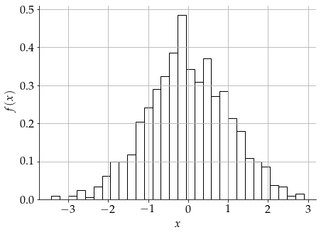

## Monochromatic colorscheme for matplotlib with opinionated sensible default

If you need a simple monochromatic colorscheme for your matplotlib figures, this is probably for you.
No fancy colors and unnecessary distractions.

To install, simply run this on terminal:
```bash 
pip install monoplt
```

or if you want the latest development version, run this instead:
```bash
pip install git+https://github.com/ariaghora/monoplt
```

## Usage

```python
from monoplt import apply_monochrome_style, generate_pattern_cycler
import matplotlib.pyplot as plt
apply_monochrome_style(plt)
```

### Example: line plot
```python
plt.figure(figsize=(7,5))
for i in range(1,5):
    plt.plot(np.arange(10), np.arange(10)*i, label=i)
plt.xlabel("$x$")
plt.ylabel("$f(x)$")
plt.legend(facecolor='white', framealpha=1)
plt.show()
```


### Example: bar plot

For plots involving fill colors (e.g., bar plot, histogram, etc.), this will give you some trouble since all colors are black, and no distinction between plotted groups.
To mitigate this issue, we can use `generate_pattern_cycler()` to get a cycler of fill patterns that characterize each group.

```python
styles = generate_pattern_cycler()

plt.figure(figsize=(7, 5))
for x in range(1,5):
    plt.bar(x, np.random.randint(2,10), label=f"Bar {x}", **next(styles))
plt.xlabel("Category")
plt.ylabel("Amount")
plt.show()
```


### Example: histogram

```python
styles = generate_pattern_cycler()
plt.figure(figsize=(7, 5))
x = np.random.randn(1000)
plt.hist(x, bins=30, density=True, **next(styles))
plt.xlabel("$x$")
plt.ylabel("$f(x)$")
plt.show()
```



### Example: pie

```python
plt.figure(figsize=(7, 5))
pie = plt.pie(
    [2, 3, 1, 5, 7, 9], 
    labels=["two", "three", "one", "five", "seven", "nine"],
)

styles = generate_pattern_cycler()
for part in pie[0]:
    part.set(**next(styles))
```


Heavily adopted from [Olsgaard's post](http://olsgaard.dk/monochrome-black-white-plots-in-matplotlib.html)
